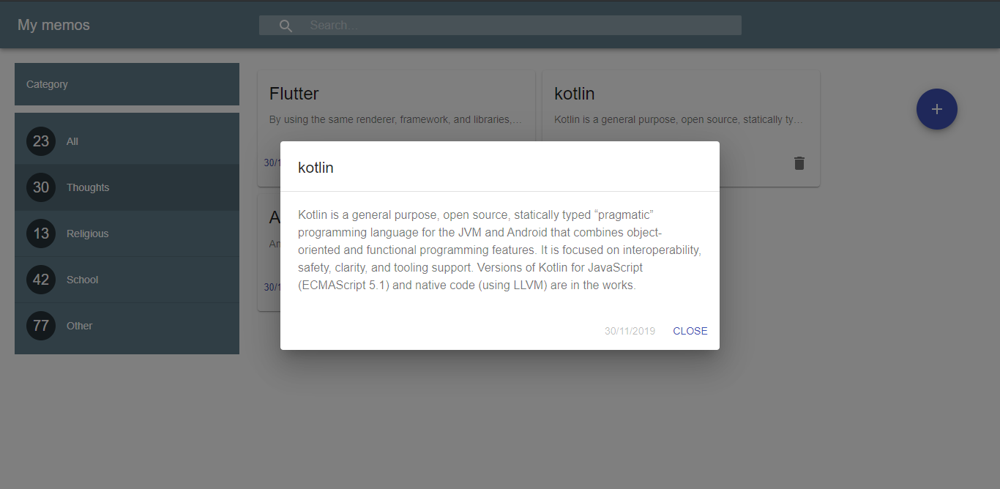
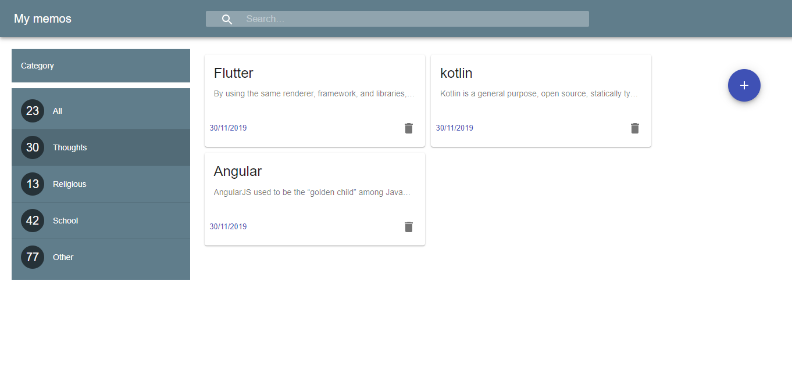

# react_project
This is a react memo app that shows the use of react-redux, react-hooks, reducers and routing with material ui integrated
so this project contains the use of
- material framework integrated with react
- react-hooks
- react-redux
- client side routing

